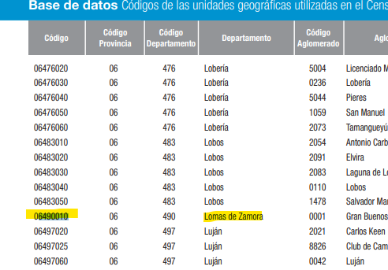
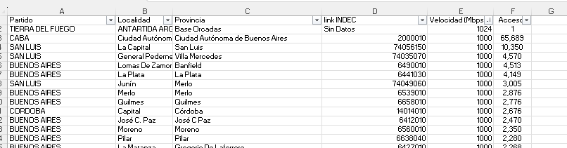
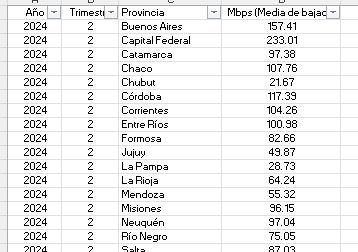
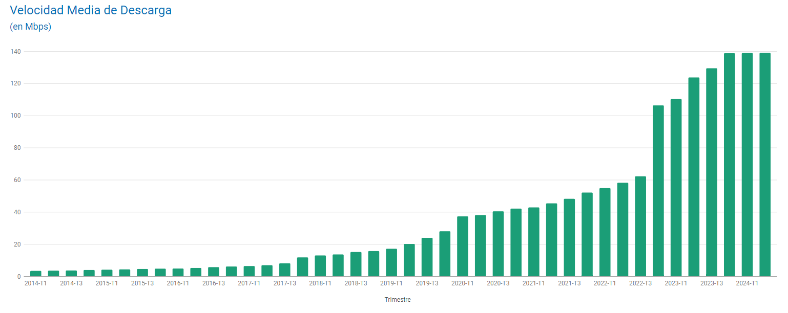

# Data Dictionary

Aquí trataremos de ahondar en el entendimiento de las distintas hojas de datos brindadas

## Archivo Internet.xlsx

Explicación básica:
https://docs.google.com/document/d/1BYW0vT_DNIjjKM9v4hNg5KmqjRNOc7OBB1jCXc80gnI/edit?tab=t.0#heading=h.hjukififf3ol

### Acc_vel_loc_sinrangos

Parece haber un problema con los nombres de las columnas. Los valores no hacen sentido con los nombres de las columnas.

Investigamos los códigos de provincia según INDEC y encontramos coincidencias con la columna Velocidad(Mbps).

Correjimos los nombres de las columnas:

Una vez correjido el error, identificamos que la hoja muestra la cantidad de accesos por plan de velocidad(Mbps) por combinación de partido/Localidad/Provincia.
Como dato adicional muestra el ID que el INDEC asigna a cada provincia.

### Velocidad_sin_rangos

Muestra datos similares a la hoja 'Acc_vel_loc_sinrangos', con las siguientes diferencias:

- No muestra detalles de Localidad / Provincia.
- Se guardan datos históricos desde el 2017 hasta el 2024 por Cuatrimestres. 

En resumen, esta hoja muestra la evolución de la cantidad de accesos por plan de velocidad (Mbps) por 'Provincia' o 'Partido' entre el 2017 y el 2024 por rangos cuatrimestrales.
Esto nos ayuda a saber 2 cosas:
- La cantidad de nuevos consumidores.
- La evolución de los planes y su demanda.

### Accesos_tecnologia_localidad

Self-explanatory name.
Cabe resaltar que la información parece ser actual y no muestra información histórica.

### Velocidad % por prov

Aqui parece haber un error el nombre. Lo que vemos no es un porcentaje, sino la evolución de el ancho de banda de bajada medio (Mbps) por provincia entre el 2014 y el 2024 en rangos cuatrimestrales.

Estos datos se corroboran con la información brindada en la página de indicadores enacom: https://indicadores.enacom.gob.ar

### Totales VMD

Parece ser un resumen general de la evolución de la velocidad media de bajada (Mbps) conjunta de los últimos 10 años.

### Totales Accesos Por Tecnología

Evolución histórica de la cantidad de accesos totales durante los últimos 10 años. La información es genérica y no por localidad.

### Accesos Por Tecnología

Evolución histórica detallada por Provincia de la cantidad de accesos.

### Penetración-población

Muestra la evolución de la penetración-población por 'Provincia' medida en cantidad de accesos por cada 100 habitantes.

Podríamos analizar las diferencias en el cambio de este indicador y ver cuales regiones tienen un menor progreso.

### Penetración-hogares

De manera similar a penetración-población, pero el indicador muestra la cantidad de accesos cada 100 hogares.

Hay que tener en cuenta que por cada hogar suele haber más de 1 persona, es decir, una familia.

### Penetración-totales

Un resumen genérico de la penetracion tanto por población y por hogar cuatrimestral. No detalla provincias.

### Totales Accesos por rango

Muestra rangos de acceso en (Mbps) y su evolución general en los últimos 10 años.

### Accesos por rangos

Muestra rangos de acceso en (Mbps) por provincia y su evolución general en los últimos 10 años.

### Dial-BAf

Parece mostrar la cantidad de accesos Banda ancha fija vs Dial Up por Provincia en los últimos 10 años.
Podemos ver la evolución en la cantidad de enlaces. 

Considerar:

- Dial-Up: Tecnología antigua. Más barata, Menos velocidad. menos segura.
- Banda Ancha: Enlaces con mayor capacidad. mas costosos, mas seguros. mas 

Podemos validad zonas con menor evolución de banda ancha.

### Totales Dial-BAf

Resumen total de la hoja anterior. Sin detalles de provincias.

### Ingresos

Cantidad de ingresos del sector telecomunicaciones durante los últimos 10 años en miles de pesos.