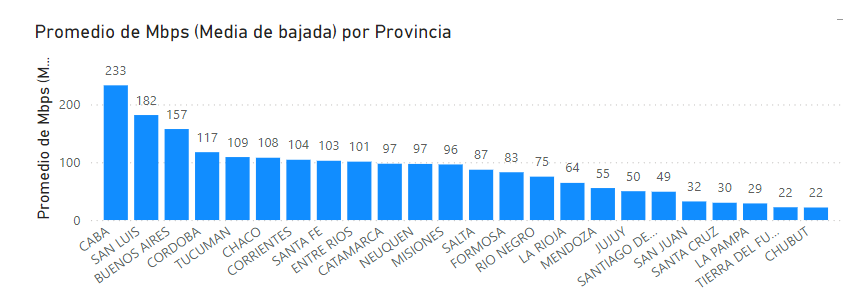

# Proyecto Data Analytics

Proyecto data analytics para la cohorte datapt11 de Henry.

## Problemática: 

Nos encontramos laborando para una empresa de telecomunicaciones especializada en enlaces de tipo WIRELESS, tanto enlaces de radio, como enlaces satelitales en partnership con la empresa STARLINK. La particularidad de estos enlaces es que ayudan a brindar tecnologías de acceso de banda ancha en lugar de baja penetración de enlaces cableados como fibra, y cablemodem.
Por este motivo, el enfoque de este análisis es identificar locaciones con baja penetración de tecnologías de banda ancha cableadas y con necesidades de nuevas ofertas para direccionar estudios de mercado y posibles despliegues de infraestructura y/o estrategias de marketing.

## Datasets

Para poder tener una idea de qué decisión tomar, nos basaremos en los siguientes datasets con información clave:

1. ACC_VEL_SIN_RANGOS: Muestra datos actuales de los accesos por plan de velocidad por provincia. Es útil para comprender los planes presentados en las distintas provincias y comprender la oferta en diversos partidos de argentina. Así mismo, nos ayuda a categorizar las regiones en base a su ancho de banda medio.
Este dataset nos ayuda a definir el KPI: 'Rate de banda ancha'. 

2. VELOCIDAD_SIN_RANGOS: Un dataset con información periódica de los últimos años detallando la cantidad de enlaces de cada región así como sus velocidades. Aquí nos enfocamos en determinar el KPI: Tasa de incremento anual de enlaces, que nos ayuda a determinar qué regiones han tenido menor incremento en la cantidad de enlaces neto.

3. ACCESOS_TECNOLOGIA_POR_LOCALIDAD: Nos ayuda a identificar qué tecnologías se han desplegado y predominan en las distintas regiones /partidos / localidades. Esto nos ayude a definir el KPI: Ratio de adopción por tecnología.

4. TOTALES_ACCESOS_POR_TECNOLOGIA: Reporta la evolución de cada tecnología a nivel nacional. Esto nos ayuda a tener un panorama de las tendencias para cada tecnología.  Así mismo, nos ayude a definir un KPI: Tasa de crecimiento anual de tecnología, con la cual podemos identificar las tecnologías que actualmente se encuentran creciendo y a que ritmo.

5. ACCESOS_POR_TECNOLOGÍA: Reporta la evolución de cada tecnología de manera detallada para cada región. Aplicando el mismo KPI pero a cada región podemos identificar zonas con baja tasa de crecimiento en tecnologías de FIBRA y CABLEMODEM.

6. PENETRACION_HOGARES: Detalla la cantidad de accesos cada 100 hogares por provincia. Nos ayuda a identificar las zonas con menor cobertura.

## KPIs:

1. Rate de banda ancha: Un indicador de la oferta de banda ancha en la región. Útil para identificar zonas con baja oferta de banda ancha.

    Rate de banda ancha =  Accesos_banda-ancha / # Total_Accesos

2. Tasa de crecimiento anual de enlaces: Mide el crecimiento anual de cantidad de enlaces por tecnologia. Nos ayuda a identificar las tecnologías en crecimiento.

    Tasa de crecimiento anual de enlaces = accesos_periodo_actual / accesos_periodo_previo  - 1

3. Ratio de adopción de tecnología: Mide la cantidad de enlaces de cierta tecnologia para una región, en comparación al total de enlaces de esta región. Nos ayude a identificar zonas con baja adopción de tecnologías de banda ancha, en necesidad de mejores ofertas.
    
    Ratio de adopción de tecnologia = accesos(tecnologia) / accesos_totales

4. Tasa crecimiento anual de tecnología: Identifica el crecimiento anual por cada tipo de tecnologia, lo que ayuda a observar si las tecnologías se encuentran en apogeo o no. Al aplicar a nivel partido, identificamos zonas con muy bajo crecimiento en cierto tipos de tecnología, lo que indica falta de inversión.

    Tasa crecimiento anual de tecnología = accesos-periodo_Actual(tecnología) / accesos_periodo_previo(tecnología)   -1

## Conclusiones

- Si bien a grandes rasgos las tecnologias de CABLEMODEM y FIBRA ÓPTICA son las que se encuentran en mayor cantidad en la actualidad, existen partidos con ausencia de estos enlaces, los cuales son buenos candidatos para la adopción de otras tecnologías wireless
- El KPI: Rate de banda ancha, nos ayuda a identificar regiones en donde no se tiene oferta de enlaces de banda ancha, los cuales son potenciales puntos para la venta de nuestros productos.
- El KPI: Tasa de incremento anual de enlaces, junto con la velocidad media por region, nos ayuda a identificar zonas que no han tenido desarrollo ni inversión en infraestructura durante los últimos años. 
- Con el KPI: Ratio de adopción de tecnología, detectamos que hay Partidos que incluso poseen un 0% de adopción de fibra y verificamos que continuan usando enlaces DIAL-UP, tecnología en decadencia y deprecada. Estas zonas son críticas y presentan focos de posibles nichos de negocio.
- Con el KPI: Tasa de crecimiento anual de tecnología, detectamos que las tecnologías que se encuentran siendo implementadas en los últimos dos años son tanto la fibra como enlaces WIRELESS, a diferencia de otros enlaces que tienen crecimiento negativo, es decir, se encuentran siendo desplazadas.
- El índice de Penetración-Hogares es un KPI en sí, y nos ayuda a  detectar las regiones con menores cobertura. Estas regiones con baja cobertura también deben ser evaluados como posibles mercados de tecnología WIRELESS.